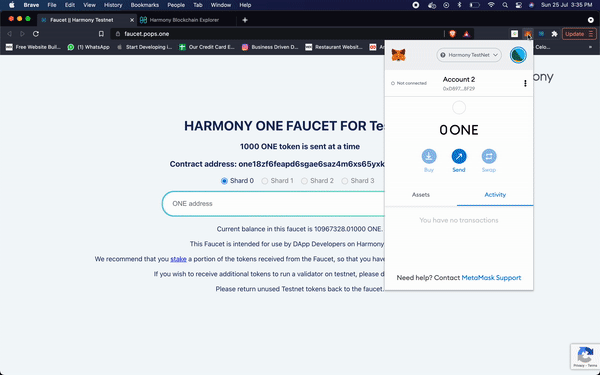

This is the tutorial from [DApp Univeristy](https://www.dappuniversity.com/) which is configured to work on harmony blockchain.

Steps
* Fund your public key with test ONE tokens ([faucet](https://faucet.pops.one/))   

* Update truffle-config.js, replace <private key> with your private key 
* `npm install`
* `truffle compile`
* `truffle migrate --reset --network testnet`
* `npm start` which should popup http://localhost:3000/ page
* make sure to connect metamask to harmony testnet, as the marketplace contracts are deployed on harmony testnet ([instructions](https://davincigalleryone.gitbook.io/davinci-gallery/connect-to-a-wallet))

